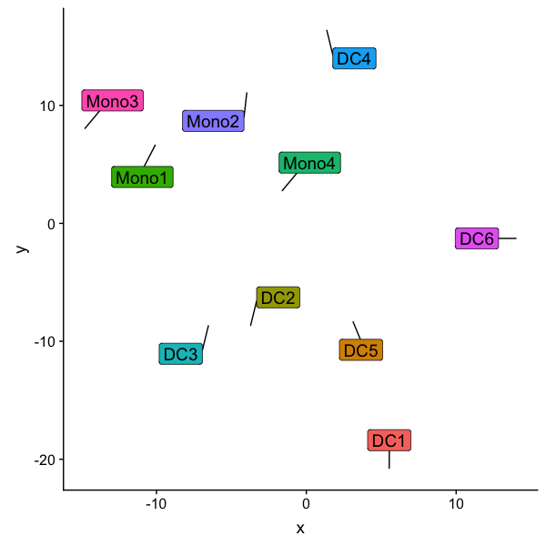

# enhancedDimPlot

An alternative to Seurat's DimPlot that provides additional facetting, group highlighting, and labeling options.
Currently, only Seurat 3 objects are supported, by SingleCellExperiment objects will be forthcoming.

With enhancedDimPlot you can easily
* add labels having a background that matches the groups:

* faceting by metadata variables:

* plot only particular subgroups:

* highlight one particular group:

* or plot just the labels:

